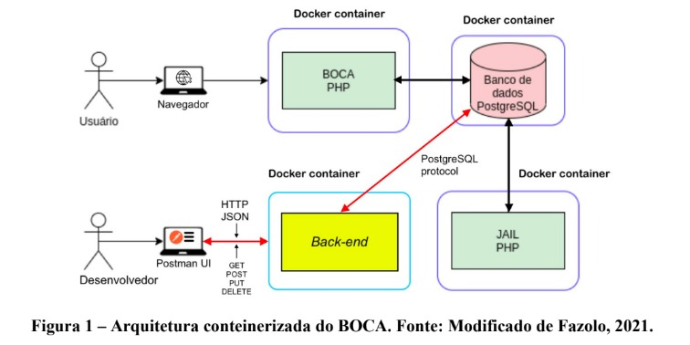
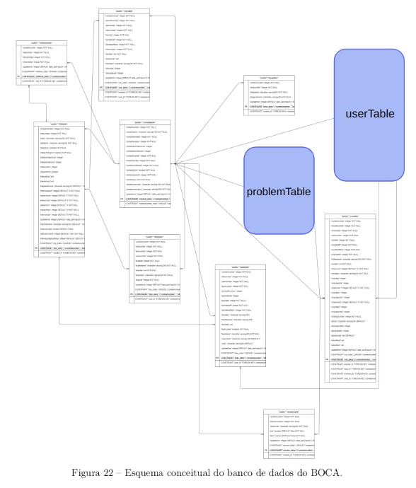
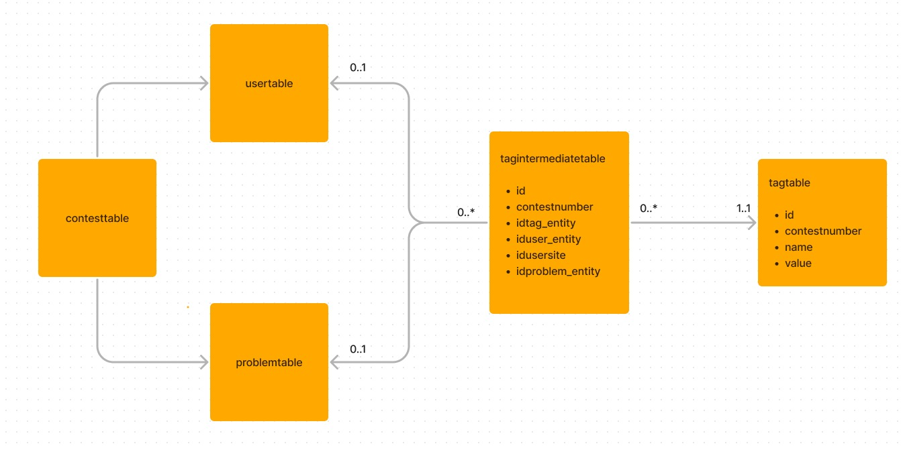

# :balloon: T1 DB : API BOCA

This work consists of developing a back-end microservice, implemented through a REST API that allows BOCA client applications to manage data through tags. The developed API allows you to create, update, delete and read a tag, besides listing all existing tags for a given contest.
The API was created using JavaScript and Node.js and its containerization was done using Docker.


# References :
To develop the API, it was used as based João Vitor Alves Fazolo's course completion work, available at:
https://github.com/joaofazolo/boca-docker

# Pre requisites :
It is necessary to install Docker and, optionally,  but strongly recommend, to make requests, the postman.

# Execution :
To run the application, follow the steps bellow:

  ```sh
    # Open a Terminal window and clone the project :
    git clone https://github.com/UFES20232BDCOMP/T1-DB.git

    # Change the current directory to boca-docker
    cd boca-docker

    #Start the Docker container
    docker compose -f docker-compose.yml -f docker-compose.prod.yml -f docker-compose.api.yml up -d --build

    #To stop API, run:
    docker compose -f docker-compose.yml -f docker-compose.prod.yml -f docker-compose.api.yml down


  ```

To see changes in database, access adminer: http://localhost:8080

# Architecture:
It was developed a container for the backend as follows below:



The database contains the follows tables:
* answertable
* bkptable
* clartable
* contesttable
* langtable
* logtable
* problemtable
* runtable
* sitetable
* sitetimetable
* tasktable
* usertable

The entities that can have associated tags are "problemtable" and "usertable":




We have to create a "tagtable" to store the tags. It is known that a problem can have many tags and a tag can be associate to many problems. The same occures to user entity. To solve this, we created a "tagintermediatetable". 
All entities are linked to "contesttable" and all request have "contestnumber" as a parameter,so it was decited to put "contestnumber" as a attribute on "tagtable" and "tagintermediatetable", to make consults on database easier.
The attributes of tagtable are simple to choose, since a tag has a name, a value, id and the contestnumber, that it was decided to put. 

However, to get in the final "tagintermediatetable" was more difficult, because "tagintermediatetable" has the attributes "id", "contestnumber" and "idtag_entity", to link to "tagtable". Additionally, it should have attributes to establish link with both the "problemtable" and the "usertable". The initial idea was to create only one attribute, "entityID", to link to both tables. Unfortunately, this violated the principle that a foreign key should be linked to only one table.

It was think to create multiple tables for entities that tags could be associated with. However, thinking about scalability, this idea seemed bad, as it could lead to the creation of numerous tables. Consequently, it was decided to have a tagintermediatetable with columns "id," "contestnumber," "idtag_entity," "iduser_entity," "idusersite," and "idproblem_entity." It needs to have "idusersite" because the primary key of "usertable" is composite by the atributes "contestnumber", "usernumber" and "usersitenumber".

The final is schema is:




This way "tagintemediatetble" have "id as primary key and two composite foreign keys:

* "idproblem_fk", composite by "contestnumber" and "idproblem_entity";
* "iduser_fk", composite by "contestnumber", "idusersite", "iduser_entity"

On the other hand, "tag table" has "id" primary key and does not have foreign keys.

# Routes
It was implemented :
* One POST route, to create tags related to user or problem.
* One PUT route, to update tags related to user or problem.
* One DELETE route, to delete an specific tag of user or problem.
* Two GET routes, one to read an specific tag of problem or user and another to read all tags of a given contest.

The full documentation of routes was make in postman. To have access to it, it is need to download the file "api-docs-elaine-and-israel.json" and import it in postman.

If you don't have postman and don't want to install it, you can make request using the follows curl commands:

## POST : createTag
To create a tag of "user":

```
curl -X POST 'http://localhost:49160/api/contest/1/tag' -H 'accept: /' -H 'Content-Type: application/json' -d '{
"entityTag": 
	{
	"entityType": "site/user",
    	"entityId": 1/1001,
   	"tag": {
         "name": "nome_tag",
        "value": "valor_tag"
   }
  }
}
```
If you want to create a tag of problem, you just have to change the name of "entityType" to "problem" and change the "entityId" to an "id" valid to problem, as "2006".

The only parameter of this route is "contestnumber" : 
http://localhost:49160/api/contest/{CONTEST_NUMBER}/tag

## GET : readTag

To read a specific tag, you have to pass the "id_tag" of this tag and its "contestnumber":

http://localhost:49160/api/contest/{CONTEST_NUMBER}/tag/{ID_TAG}

The curl command to read a tag is:

```
curl -X 'GET' 'http://localhost:49160/api/contest/1/tag/1' -H 'accept: /'
```
In this example, we're reading tag number one of contest number one.


## GET : readAllTags

To read all tags of a contest, you have to pass the "contestnumber":

http://localhost:49160/api/contest/{CONTEST_NUMBER}/tag

The curl command is:
```
curl -X 'GET' 'http://localhost:49160/api/contest/1/tag' -H 'accept: /'
```
In this example, we're reading all tags of contest number one.


## PUT : updateTag

To update a tag, you have to pass the "contestnumber" and the "id_tag" as parameter.
http://localhost:49160/api/contest/{CONTEST_NUMBER}/tag/{ID_TAG}

It is necessary to specify the new value or new name of tag. In this method is allowed to change name, value or both, but is not allowed to change which entity, "problem" or "user" the tag is associated.

 The curl command is :
 ```
curl -X 'PUT' 'http://localhost:49160/api/contest/1/tag/1' -H 'Content-Type: application/json' -d '{
  "name": "NovoNome",
  "value": "NovoValor"
}
```

In this example, we're updating tag number of contest number one.

## DELETE : deleteTag

To delete a tag, you have to pass "contestnumber" and the "id_tag"

http://localhost:49160/api/contest/{CONTEST_NUMBER}/tag/{ID_TAG}

The curl command is :

```
 curl -X DELETE 'http://localhost:49160/api/contest/1/tag/1'
```

In this example, we're deleting tag number one of contest number one.


## Tests and future works:

All tests were done manually. It's important to note that we checked if the request was in the correct format. For instance, all routes have 'contestnumber' as a parameter, so we verified if this information was passed in the request. However, we did not check if the contest number provided actually existed in the database. The same approach was taken with 'id_tag'. If we continue developing this API, the next steps will involve implementing automated testing and enhancing the validation of information within the request.